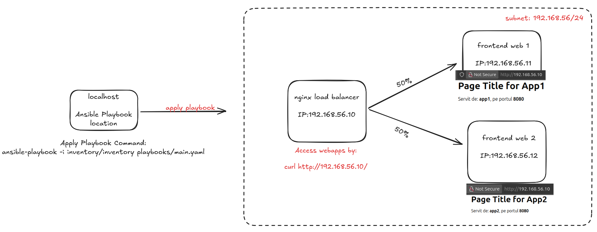

# Load Balancer + Appservers with Ansible & Vagrant

This project demonstrates the configuration of a simple production environment using Vagrant + Ansible:

- 2 application servers (app1, app2) with Nginx installed and configured.
- 1 Load Balancer server (lb) with HAProxy, performing round-robin between the two app servers.

### Structure

- Link: https://docs.ansible.com/ansible/2.8/user_guide/playbooks_best_practices.html#use-dynamic-inventory-with-clouds 
- Layout: Alternative Directory Layout

### Architecture:



# Run:

- Start the VMs:

```bash
vagrant up
```

- Run the Playbook:

```bash
/LB_Ansible-Configuration$ ansible-playbook -i inventory/inventory playbooks/main.yaml
```

- Access the load balancer:
```bash
curl http://192.168.56.10/
```

### Notes

- Common variables are defined in inventory/group_vars/
- Host-specific variables are in host_vars/
- The roles (nginx_app, lb) are independent and can be reused in other projects